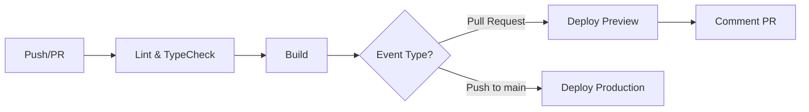

# 📚 Book Web - Tienda de Libros Online

> Aplicación web moderna para la gestión y venta de libros, construida con React, TypeScript y Vite. Incluye CI/CD automatizado con GitHub Actions y despliegue en Vercel.

[](https://github.com/ronalmoctz/book_web/actions)
[](https://book-ronal.vercel.app/)
[](https://www.typescriptlang.org/)
[](https://react.dev/)

[🔗 Demo en Vivo](https://book-ronal.vercel.app/) | [📖 Documentación API](#api-integration)

---

## 🎯 Descripción

Book Web es una aplicación full-stack que permite explorar, buscar y gestionar un catálogo de libros. El proyecto destaca por su arquitectura limpia, implementación de principios SOLID/DRY, y un pipeline CI/CD completo.

**Características principales:**
- ✅ Catálogo de libros con búsqueda en tiempo real
- ✅ Modal interactivo para detalles de cada libro
- ✅ Formulario avanzado para agregar nuevos libros
- ✅ Validación de datos en tiempo real
- ✅ Preview de imágenes con validación de tamaño/tipo
- ✅ SEO optimizado con meta tags completos
- ✅ Diseño responsive y accesible (ARIA labels)
- ✅ CI/CD automatizado con GitHub Actions
- ✅ Deploy automático en Vercel

---

## 🛠️ Stack Tecnológico

### **Frontend**
- **React 19** - Framework de UI con hooks modernos
- **TypeScript 5.6** - Tipado estático para mayor seguridad
- **Vite 6** - Build tool ultrarrápido con HMR
- **React Router DOM** - Enrutamiento del lado del cliente
- **Tailwind CSS** - Utility-first CSS framework

### **Librerías UI**
- **shadcn/ui** - Componentes accesibles y customizables
- **Radix UI** - Primitivos de UI sin estilos
- **Lucide React** - Iconos modernos
- **MagicUI** - Componentes con animaciones

### **Herramientas de Desarrollo**
- **ESLint** - Linter para mantener calidad de código
- **PostCSS** - Procesador de CSS
- **Autoprefixer** - Prefijos CSS automáticos

### **CI/CD**
- **GitHub Actions** - Automatización de workflows
- **Vercel** - Plataforma de deployment

---

## 🏗️ Arquitectura y Patrones

### **Principios SOLID Aplicados**

#### 1. **Single Responsibility Principle (SRP)**
Cada componente y hook tiene una única responsabilidad:

```typescript
// ✅ Hook dedicado exclusivamente a la validación del formulario
export function useBookForm() {
  // Gestiona estado, validación y manejo de cambios
  return { form, handleChange, handleBlur, getError, validateAll };
}

// ✅ Componente dedicado solo a mostrar detalles
export function BookModal({ book, authorName, isOpen, onClose }) {
  // Solo renderiza información, no gestiona lógica de negocio
}
```

#### 2. **Open/Closed Principle (OCP)**
Componentes extensibles mediante props:

```typescript
// Componente abierto a extensión, cerrado a modificación
<FormField
  id="title"
  label="Título"
  type="text"
  min={1}
  max={200}
  onChange={handleChange}
  error={getError("title")}
/>
```

#### 3. **Dependency Inversion**
Dependencia de abstracciones (hooks) en lugar de implementaciones concretas:

```typescript
// Los componentes dependen de hooks abstractos
const { books, loading, error } = useBooks();
const { authors } = useAuthors();
```

### **Principio DRY (Don't Repeat Yourself)**

Eliminación de código duplicado mediante componentes y hooks reutilizables:

**Antes (487 líneas con duplicación):**
```typescript
// Código repetido 15+ veces
<div>
  <Label htmlFor="title">Título</Label>
  <Input id="title" name="title" onChange={handleChange} />
  {getError("title") && <span className="error">{getError("title")}</span>}
</div>
```

**Después (350 líneas, -28% de código):**
```typescript
// Componente reutilizable
<FormField
  id="title"
  label="Título"
  name="title"
  onChange={handleChange}
  error={getError("title")}
/>
```

### **Custom Hooks para Lógica Reutilizable**

```typescript
// useBooks.ts - Hooks especializados
export const useBooks = () => useFetch<Book[]>("/books", []);
export const useAuthors = () => useFetch<Author[]>("/authors", []);
export const useGenres = () => useFetch<Genre[]>("/genres", []);
export const usePublishers = () => useFetch<Publisher[]>("/publishers", []);

// useBookForm.ts - Validación centralizada
export function useBookForm() {
  const validateField = (key: keyof BookForm, value: any): string => {
    // Reglas de validación centralizadas
  };
  
  return { form, handleChange, handleBlur, getError, validateAll };
}
```

---

## 🔌 API Integration

### **Consumo de API REST con Fetch**

La aplicación consume una API REST para obtener y enviar datos de libros, autores, géneros y editoriales.

#### **Hook Genérico `useFetch`**

```typescript
// src/hooks/useFetch.ts
export function useFetch<T>(path: string, deps: unknown[] = []) {
  const [data, setData] = useState<T | null>(null);
  const [loading, setLoading] = useState(true);
  const [error, setError] = useState<Error | null>(null);

  useEffect(() => {
    const controller = new AbortController();
    
    fetch(buildUrl(path), { signal: controller.signal })
      .then(res => res.ok ? res.json() : Promise.reject(res))
      .then(setData)
      .catch(err => {
        if (err.name !== "AbortError") setError(err);
      })
      .finally(() => setLoading(false));
    
    return () => controller.abort(); // Cleanup
  }, deps);

  return { data, loading, error };
}
```

**Características:**
- ✅ Tipado genérico con TypeScript
- ✅ Manejo de estados: `loading`, `error`, `data`
- ✅ Cancelación de requests con `AbortController`
- ✅ Cleanup automático al desmontar componente

#### **Hook para POST Requests**

```typescript
// src/hooks/usePost.ts
export function usePost<T>(path: string) {
  const [loading, setLoading] = useState(false);
  const [error, setError] = useState<Error | null>(null);

  const post = async (body: BodyInit): Promise<T> => {
    setLoading(true);
    setError(null);
    
    try {
      const res = await fetch(buildUrl(path), {
        method: "POST",
        body,
      });
      
      if (!res.ok) throw new Error(await res.text());
      return await res.json();
    } catch (err) {
      setError(err as Error);
      throw err;
    } finally {
      setLoading(false);
    }
  };

  return { post, loading, error };
}
```

#### **Ejemplo de Uso en Componentes**

```typescript
// Obtener datos
const { books, loading, error } = useBooks();
const { authors } = useAuthors();

// Enviar datos
const { post, loading: posting } = usePost<Book>("/books");

const handleSubmit = async (formData: FormData) => {
  try {
    await post(formData);
    alert("Libro creado exitosamente!");
  } catch (err) {
    console.error("Error al crear libro:", err);
  }
};
```

#### **Endpoints Disponibles**

| Method | Endpoint | Descripción |
|--------|----------|-------------|
| `GET` | `/books` | Obtiene todos los libros |
| `GET` | `/authors` | Obtiene todos los autores |
| `GET` | `/genres` | Obtiene todos los géneros |
| `GET` | `/publishers` | Obtiene todas las editoriales |
| `POST` | `/books` | Crea un nuevo libro (multipart/form-data) |

**URL Base de la API:**
```typescript
// src/utils/api.ts
const API_URL = import.meta.env.VITE_API_URL || "http://localhost:3000";

export const buildUrl = (path: string) => `${API_URL}${path}`;
```

---

## 🚀 CI/CD Pipeline

### **GitHub Actions Workflow**

El proyecto incluye un pipeline completo de CI/CD que se ejecuta automáticamente en cada push o pull request.

#### **Flujo del Pipeline**



#### **Jobs del Workflow**

**1. Lint & Type Check** 🔍
```yaml
- Ejecuta ESLint para calidad de código
- Verifica tipos con TypeScript
- Bloquea merge si hay errores
```

**2. Build** 🏗️
```yaml
- Compila el proyecto con Vite
- Genera artifacts de producción
- Sube build para deployments
```

**3. Deploy Preview** 🚀 (Solo en PRs)
```yaml
- Crea deployment preview en Vercel
- Comenta URL en el PR
- Cada PR tiene su propia preview URL
```

**4. Deploy Production** 🌐 (Solo en main)
```yaml
- Despliega a producción en Vercel
- URL: https://book-ronal.vercel.app/
- Deployment automático al hacer merge
```

#### **Configuración de Secrets**

Para que el pipeline funcione, configura estos secrets en GitHub:

| Secret | Descripción |
|--------|-------------|
| `VERCEL_TOKEN` | Token de autenticación de Vercel |
| `VERCEL_ORG_ID` | ID de organización/cuenta |
| `VERCEL_PROJECT_ID` | ID del proyecto |

**Cómo obtener los secrets:**
```bash
# Vincula el proyecto con Vercel
vercel link

# Los IDs estarán en:
cat .vercel/project.json
```

#### **Ejemplo de Output del Pipeline**

```
✓ Lint & TypeCheck (45s)
✓ Build (1m 20s)
✓ Deploy Production (2m 15s)
  → https://book-ronal.vercel.app/
```

---

## 📁 Estructura del Proyecto

```
book_web/
├── .github/
│   └── workflows/
│       └── ci-cd.yml          # Pipeline de CI/CD
├── public/
│   └── icon.svg               # Favicon personalizado
├── src/
│   ├── components/
│   │   ├── ui/                # Componentes base (shadcn)
│   │   │   ├── FormField.tsx  # Campo de formulario reutilizable
│   │   │   ├── SelectField.tsx # Select reutilizable
│   │   │   ├── ToggleSwitch.tsx # Switch para booleans
│   │   │   └── FileUpload.tsx  # Upload con preview
│   │   ├── magicui/           # Componentes animados
│   │   ├── BookModal.tsx      # Modal de detalles del libro
│   │   └── Search.tsx         # Búsqueda con Cmd+K
│   ├── hooks/
│   │   ├── useFetch.ts        # Hook genérico para GET
│   │   ├── usePost.ts         # Hook genérico para POST
│   │   ├── useBooks.ts        # Hooks especializados
│   │   └── useBookForm.ts     # Validación de formularios
│   ├── pages/
│   │   └── InsertBook.tsx     # Formulario de agregar libro
│   ├── types/
│   │   ├── book.ts            # Tipos de Book
│   │   ├── author.ts          # Tipos de Author
│   │   ├── genre.ts           # Tipos de Genre
│   │   └── publisher.ts       # Tipos de Publisher
│   ├── utils/
│   │   ├── api.ts             # Configuración de API
│   │   └── authors.ts         # Utilidades de autores
│   ├── constants/
│   │   └── config.ts          # Constantes globales
│   ├── App.tsx                # Componente principal
│   ├── main.tsx               # Entry point
│   └── main.css               # Estilos Tailwind custom
├── index.html                 # HTML con SEO optimizado
├── vite.config.ts             # Configuración de Vite
├── tailwind.config.js         # Configuración de Tailwind
├── tsconfig.json              # Configuración de TypeScript
└── package.json               # Dependencias y scripts
```

---

## 🎨 Diseño y UX

### **Paleta de Colores**

```typescript
// src/constants/config.ts
export const COLORS = {
  bg: {
    primary: "#FFF8ED",  // Fondo cálido
    card: "#FFD9A0",     // Cards destacadas
  },
  text: {
    primary: "#293241",  // Texto principal
  },
  accent: {
    primary: "#EE6C4D",  // Botones y acciones
    hover: "#d95b3d",    // Hover state
  },
};
```

### **Características de Accesibilidad**

- ✅ **ARIA labels** comprehensivos
- ✅ **Navegación por teclado** completa
- ✅ **Focus visible** en todos los elementos interactivos
- ✅ **Screen reader** friendly
- ✅ **Semantic HTML** (`main`, `nav`, `article`, `figure`)
- ✅ **Alt text** descriptivo en todas las imágenes

### **SEO Optimizado**

```html
<!-- Meta tags completos -->
<title>Tu Tienda de Libros Online | Compra los Mejores Libros</title>
<meta name="description" content="..." />
<link rel="canonical" href="https://book-ronal.vercel.app/" />

<!-- Open Graph -->
<meta property="og:title" content="..." />
<meta property="og:image" content="..." />

<!-- Twitter Cards -->
<meta name="twitter:card" content="summary_large_image" />
```

---

## 🚦 Instalación y Configuración

### **Requisitos Previos**

- Node.js >= 18
- Bun >= 1.0 (o npm/yarn)
- Git

### **Instalación**

```bash
# Clonar el repositorio
git clone https://github.com/ronalmoctz/book_web.git
cd book_web

# Instalar dependencias
bun install

# Configurar variables de entorno
cp .env.example .env
# Edita .env con tu API_URL
```

### **Variables de Entorno**

```env
# .env
VITE_API_URL=http://localhost:3000
```

### **Scripts Disponibles**

```bash
# Desarrollo (con HMR)
bun dev

# Build para producción
bun run build

# Preview del build
bun run preview

# Linting
bun run lint

# Type checking
bun run tsc --noEmit
```

---

## 🌐 Despliegue

### **Vercel (Recomendado)**

```bash
# Instalar Vercel CLI
npm i -g vercel

# Deploy
vercel

# Deploy a producción
vercel --prod
```

### **Build Manual**

```bash
# Generar build
bun run build

# La carpeta dist/ contiene los archivos estáticos
# Sube dist/ a cualquier servidor de archivos estáticos
```

---

## 📊 Métricas del Proyecto

| Métrica | Valor |
|---------|-------|
| **Líneas de Código** | ~3,500 |
| **Componentes Reutilizables** | 10+ |
| **Custom Hooks** | 5 |
| **Cobertura TypeScript** | 100% |
| **Reducción de Código (DRY)** | -28% |
| **Lighthouse SEO Score** | 90+ |
| **Lighthouse Performance** | 85+ |

---

## 🔧 Mejoras Futuras

- [ ] Testing unitario con Vitest
- [ ] Testing E2E con Playwright
- [ ] Paginación en el catálogo
- [ ] Filtros avanzados (género, autor, precio)
- [ ] Carrito de compras
- [ ] Autenticación de usuarios
- [ ] Panel de administración
- [ ] Dark mode toggle
- [ ] Internacionalización (i18n)

---

## 🤝 Contribución

Las contribuciones son bienvenidas. Por favor:

1. Fork el proyecto
2. Crea un branch (`git checkout -b feature/AmazingFeature`)
3. Commit tus cambios (`git commit -m 'Add some AmazingFeature'`)
4. Push al branch (`git push origin feature/AmazingFeature`)
5. Abre un Pull Request

---

## 👨‍💻 Autor

**Ronal Moctz**

- GitHub: [@ronalmoctz](https://github.com/ronalmoctz)
- Proyecto: [Book Web](https://github.com/ronalmoctz/book_web)
- Demo: [book-ronal.vercel.app](https://book-ronal.vercel.app/)

---

## 🙏 Agradecimientos

- [shadcn/ui](https://ui.shadcn.com/) - Componentes UI
- [Radix UI](https://www.radix-ui.com/) - Primitivos accesibles
- [Lucide](https://lucide.dev/) - Iconos
- [Vercel](https://vercel.com/) - Hosting

---

**⭐ Si este proyecto te fue útil, considera darle una estrella en GitHub!**
